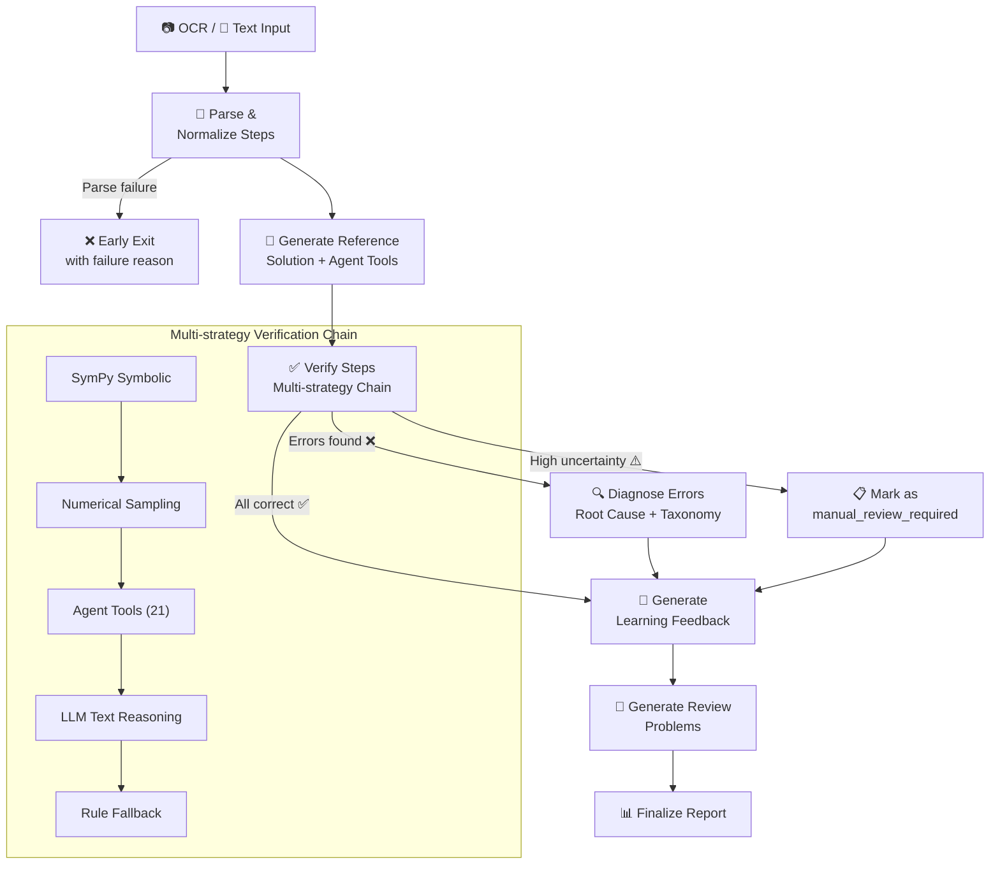

# 🔬 STEM Tutor Agent

> **Your math is wrong. Here's exactly where and why.**

AI agent that verifies every step of a student solution, pinpoints the root cause of errors with SymPy symbolic math, and generates targeted practice — covering 8 STEM subjects with a full-featured web UI.

**English** | [中文](README.zh-CN.md)

[](https://python.org)
[](https://github.com/langchain-ai/langgraph)
[](https://fastapi.tiangolo.com)
[](https://sympy.org)
[](LICENSE)

## How It Works



## Why STEM Tutor Agent?

Paste your solution into ChatGPT and it says *"This is incorrect."* STEM Tutor Agent says:

> **Step 3 has a chain rule misuse** — you applied $\frac{d}{dx}f(g(x))$ as $f'(g(x))$ instead of $f'(g(x)) \cdot g'(x)$. This is error code `CHAIN_RULE_MISUSE`.

| Generic LLM Chat | STEM Tutor Agent |
|---|---|
| "Your answer is wrong" | Pinpoints **exact step** with error code |
| No structured verification | **Multi-strategy chain**: SymPy → numerical → agent tools → LLM → rules |
| One-shot feedback | **Follow-up chat** to drill into any step |
| No practice problems | Auto-generates **targeted review problems** based on weak points |
| Text-only input | **OCR + image crop + LaTeX preview** |
| No progress tracking | **Learning reports** aggregating knowledge gaps across problems |

## Key Features

- 🔢 **Multi-strategy Verification** — 5-layer chain (SymPy symbolic → numerical sampling → 21 agent tools → LLM reasoning → rule fallback) verifies every step with mathematical rigor
- 🎯 **Structured Error Diagnosis** — 9 error codes across 4 categories (rule application, algebraic manipulation, theorem misuse, conceptual confusion) with evidence chains and confidence scores
- 📝 **Targeted Practice Generation** — Auto-generates 1–3 review problems targeting identified weak points, not random exercises
- 🧪 **8 STEM Subjects** — Calculus, Linear Algebra, Mechanics, Electromagnetism, Optics, Quantum Mechanics, Relativity, Thermodynamics with per-subject YAML configs and error taxonomy
- 🖥️ **Full Web UI** — FastAPI + vanilla JS SPA with OCR upload (crop + drag-and-drop), KaTeX preview, SSE streaming, follow-up chat, batch queue, user accounts, and admin panel
- ⚡ **Budget-Aware Agent** — Global budget pool + per-node time quotas; 3 depth levels (`quick` / `standard` / `thorough`) with automatic fallback to lightweight strategies

## Quick Start

### Requirements

- Python 3.10+ (3.11 recommended)

### Install & Run

```bash
pip install -e .
python -m web.app
```

Visit http://localhost:8000. First startup auto-creates admin account: `admin / admin123`.

<details>
<summary>📖 More ways to run</summary>

**One-Click Public Access (Windows)**

Double-click `start.bat` to launch local server + Cloudflare Tunnel for automatic public URL (requires [cloudflared](https://developers.cloudflare.com/cloudflare-one/connections/connect-networks/downloads/)).

**CLI**

```bash
# Mock mode (no API key needed)
python -m cli.main --input fixtures/sample_case.json --provider mock

# Real model API
python -m cli.main --input fixtures/sample_case.json --provider real --health-check
```

**Run Tests**

```bash
pytest -q
```

All 24 test files use `tmp_path` + `monkeypatch` for database isolation — no real LLM services needed.

</details>

## Architecture

### Directory Structure

```
stem-tutor-agent/
├── stem_tutor/
│   ├── domain/              # Pydantic data models
│   ├── graph/               # LangGraph state definitions & workflow
│   │   ├── state.py         #   Global state TutorGraphState
│   │   ├── workflow.py      #   Main graph construction & execution
│   │   ├── budget.py        #   Per-node time budget management
│   │   ├── global_budget.py #   Cross-node global budget pool
│   │   ├── agent_subgraph.py#   Agent subgraph (tool calling)
│   │   ├── strategy.py      #   Multi-strategy verification chain
│   │   └── observability.py #   Provider call tracing & uncertainty flags
│   ├── nodes/               # Business node implementations
│   ├── prompts/             # Prompt templates
│   ├── providers/           # LLM provider abstraction layer
│   ├── subjects/            # Subject configs (8 YAMLs) & auto-detection
│   ├── taxonomy/            # Error taxonomy
│   ├── tools/               # Agent computation tools (21 tools)
│   ├── evaluation/          # Evaluation framework
│   ├── settings.py          # Config loading (env vars + key.env)
│   └── sympy_verify.py      # SymPy symbolic verification engine
├── web/
│   ├── app.py               # FastAPI routes (35+ endpoints)
│   ├── database.py          # SQLite CRUD (8 tables)
│   ├── auth.py              # JWT authentication
│   ├── batch_worker.py      # Background queue worker
│   ├── templates/           # HTML templates
│   └── static/              # CSS / JS (vanilla SPA)
├── cli/                     # CLI entry points
├── tests/                   # 24 test files
└── fixtures/                # Test samples
```

### Core Workflow

8-node LangGraph StateGraph with conditional routing:

| Node | Role |
|------|------|
| `ocr_preprocess` | Image OCR preprocessing (optional) |
| `parse_student_solution` | Split & normalize student steps |
| `generate_reference_solution` | LLM reference + Agent tool calls |
| `verify_steps` | Multi-strategy verification (core) |
| `diagnose_error` | Root cause diagnosis + taxonomy |
| `generate_feedback` | Student-facing learning feedback |
| `generate_review_problems` | Targeted practice generation |
| `finalize_report` | Report assembly |

<details>
<summary>🔧 Agent Tool Chain (21 tools)</summary>

| Module | Tool | Description |
|--------|------|-------------|
| **General** | `execute_python` | Sandboxed Python subprocess execution |
| **Calculus** | `compute_derivative` | Symbolic differentiation |
| | `compute_integral` | Definite / indefinite integration |
| | `compute_limit` | Limit computation |
| | `compute_series` | Taylor expansion |
| | `solve_equation` | Equation solving |
| | `solve_ode` | ODE solving |
| | `simplify_expression` | Expression simplification |
| | `compute_pipeline` | Batch multi-step computation (with `$1`, `$2` references) |
| **Linear Algebra** | `matrix_multiply` | Matrix multiplication |
| | `matrix_add` | Matrix addition |
| | `matrix_inverse` | Matrix inversion |
| | `matrix_determinant` | Determinant |
| | `matrix_eigenvalues` | Eigenvalues |
| | `matrix_eigenvectors` | Eigenvectors |
| | `matrix_rank` | Matrix rank |
| | `matrix_rref` | Reduced row echelon form |
| | `matrix_transpose` | Transpose |
| | `matrix_trace` | Trace |
| | `solve_linear_system` | Linear system solving |

</details>

<details>
<summary>🗄️ Database Schema (8 tables)</summary>

| Table | Description |
|-------|-------------|
| `users` | User accounts (id, username, password_hash, is_admin, created_at) |
| `runs` | Analysis run records (JSON data, status, subject, problem_text) |
| `chats` | Chat history (linked by run_id, messages as JSON array) |
| `reports` | Learning reports (JSON data, title) |
| `user_settings` | User preferences (JSON) |
| `user_mastery` | User mastery data (JSON) |
| `batches` | Batch analysis batches (status, settings_json, count stats) |
| `batch_items` | Batch items (problem_text, student_solution, status, run_id) |

</details>

## Web API

### Core Endpoints

| Method | Path | Description |
|--------|------|-------------|
| `POST` | `/analyze/stream` | Streaming analysis via SSE |
| `POST` | `/analyze` | Synchronous analysis |
| `POST` | `/chat/stream` | Streaming follow-up chat |
| `POST` | `/ocr` | Image OCR recognition |
| `POST` | `/detect-subject` | Auto-detect problem subject |
| `POST` | `/report/generate` | Generate learning report |

<details>
<summary>📋 Full API Reference (35+ endpoints)</summary>

**Analysis**

| Method | Path | Description |
|--------|------|-------------|
| `POST` | `/analyze` | Synchronous analysis, returns full result |
| `POST` | `/analyze/stream` | Streaming analysis via SSE |
| `GET` | `/analyze/status/{run_id}` | Query run status |
| `GET` | `/analyze/result/{run_id}` | Get run result |
| `POST` | `/analyze/cancel/{run_id}` | Cancel running analysis |
| `POST` | `/api/verify-step` | Single-step re-verification |

**Follow-up Chat**

| Method | Path | Description |
|--------|------|-------------|
| `POST` | `/chat/stream` | Streaming follow-up chat (SSE) |
| `GET` | `/chat/history/{run_id}` | Get chat history |

**Learning Reports**

| Method | Path | Description |
|--------|------|-------------|
| `POST` | `/report/generate` | Generate learning report (streaming SSE) |
| `GET` | `/report/data` | Get report data (with date filtering) |
| `GET` | `/report/runs` | List runs available for report generation |
| `GET` | `/report/list` | Paginated list of generated reports |
| `GET` | `/report/{report_id}` | Get report details |
| `DELETE` | `/report/{report_id}` | Delete a report |

**Run Management**

| Method | Path | Description |
|--------|------|-------------|
| `GET` | `/history` | Run history list (paginated with filters) |
| `GET` | `/stats` | Aggregate statistics |
| `DELETE` | `/api/runs` | Batch delete runs |
| `POST` | `/api/runs/cleanup` | Cleanup runs older than N days |

**Batch Analysis Queue**

| Method | Path | Description |
|--------|------|-------------|
| `POST` | `/batch/create` | Create batch analysis |
| `GET` | `/batch/list` | List current user's batches |
| `GET` | `/batch/{batch_id}/status` | Query batch status & progress |
| `POST` | `/batch/{batch_id}/pause` | Pause a batch |
| `POST` | `/batch/{batch_id}/resume` | Resume a batch |
| `POST` | `/batch/{batch_id}/cancel` | Cancel a batch |
| `DELETE` | `/batch/{batch_id}` | Delete a batch |

**Authentication**

| Method | Path | Description |
|--------|------|-------------|
| `POST` | `/api/auth/register` | Register a new user |
| `POST` | `/api/auth/login` | Login and get JWT token |
| `GET` | `/api/auth/me` | Get current user info |

**User Settings & Mastery**

| Method | Path | Description |
|--------|------|-------------|
| `GET` | `/api/user/settings` | Get user preferences |
| `POST` | `/api/user/settings` | Save user preferences |
| `GET` | `/api/user/mastery` | Get user mastery data |
| `POST` | `/api/user/mastery` | Update user mastery data |

**Admin Endpoints** (requires admin role)

| Method | Path | Description |
|--------|------|-------------|
| `GET` | `/api/admin/users` | List all users |
| `GET` | `/api/admin/stats` | System statistics overview |
| `DELETE` | `/api/admin/users/{user_id}` | Delete user |
| `GET` | `/api/admin/users/{user_id}` | User info + settings + mastery |
| `GET` | `/api/admin/users/{user_id}/runs` | User's run records |
| `GET` | `/api/admin/users/{user_id}/reports` | User's learning reports |
| `GET` | `/api/admin/users/{user_id}/chats` | User's chat records |
| `GET` | `/api/admin/users/{user_id}/settings` | User settings detail |
| `GET` | `/api/admin/users/{user_id}/mastery` | User mastery detail |
| `GET` | `/api/admin/users/{user_id}/run/{run_id}` | Run detail with raw output |

**Streaming Response Example**

`/analyze/stream` returns Server-Sent Events:

```
data: {"type": "start", "run_id": "...", "message": "Analysis started"}
data: {"type": "node_start", "node": "parse_student_solution", "label": "Parsing solution steps"}
data: {"type": "progress", "node": "parse_student_solution", "detail": "Parsed 5 solution steps"}
data: {"type": "node_done", "node": "parse_student_solution", "label": "Parsing solution steps", "partial": {...}}
...
data: {"type": "result", "data": {...}}
data: {"type": "done", "message": "Analysis complete"}
```

</details>

## Configuration

The project reads `key.env` from the workspace root (see `key.env.example`), with environment variable overrides.

### Basic

| Variable | Description | Default |
|---|---|---|
| `STEM_TUTOR_PROVIDER` | Provider type (`mock` / `openai-compatible`) | `mock` |
| `STEM_TUTOR_SUBJECT` | Default subject | `calculus` |
| `PARATERA_API_KEY` | LLM API key | (empty) |
| `PARATERA_URL` | LLM API URL | (empty) |

<details>
<summary>⚙️ All Configuration Options</summary>

### Models

| Variable | Description | Default |
|---|---|---|
| `STEM_TUTOR_REASONING_MODEL` | Reasoning model (reference solution generation, etc.) | `qwen/qwen3.6-plus` |
| `STEM_TUTOR_FAST_MODEL` | Fast model (verification, diagnosis, feedback, etc.) | `deepseek/deepseek-v3.2` |
| `STEM_TUTOR_OCR_MODEL` | OCR vision model | `qwen/qwen3.6-plus` |
| `STEM_TUTOR_BASELINE_GLM5_MODEL` | Baseline comparison model (GLM5) | `qwen/qwen3-30b-a3b-instruct-2507` |
| `STEM_TUTOR_BASELINE_KIMI_MODEL` | Baseline comparison model (Kimi) | `qwen/qwen3-30b-a3b-instruct-2507` |
| `STEM_TUTOR_DETECTION_MODEL` | Subject detection model | `qwen/qwen3-30b-a3b-instruct-2507` |
| `STEM_TUTOR_VERIFY_MODEL_GROUP` | Model group for verification | `fast` |
| `STEM_TUTOR_VERIFY_MODEL` | Override verification model (empty = use model group) | (empty) |

### Feature Flags & Parameters

| Variable | Description | Default |
|---|---|---|
| `STEM_TUTOR_SYMPY_ENABLED` | Enable SymPy symbolic verification | `true` |
| `STEM_TUTOR_SYMPY_TIMEOUT` | SymPy computation timeout (seconds) | `3.0` |
| `STEM_TUTOR_TOOL_CALLING` | Enable Agent tool calling | `false` |
| `STEM_TUTOR_DUAL_MODEL` | Enable dual-model Agent mode | `false` |
| `STEM_TUTOR_BUDGET_ENABLED` | Enable global budget management | `false` |
| `STEM_TUTOR_LOAD_LEGACY_TOOLS` | Load full tool set | `false` |
| `STEM_TUTOR_PYTHON_EXECUTABLE` | Python sandbox interpreter path | (empty) |
| `STEM_TUTOR_PYTHON_TIMEOUT` | Python sandbox timeout (seconds) | `10.0` |
| `STEM_TUTOR_TIMEOUT` | Request timeout (seconds) | `300` |
| `STEM_TUTOR_MAX_RETRIES` | Maximum retries | `1` |
| `STEM_TUTOR_ALLOW_MOCK_FALLBACK` | Allow fallback to mock | `true` |
| `STEM_TUTOR_DEPTH` | Analysis depth (`quick` / `standard` / `thorough`) | `standard` |
| `STEM_TUTOR_SIMPLE_FASTPATH` | Enable simple question fast path | `true` |
| `STEM_TUTOR_DETERMINISTIC_VERIFY` | Enable deterministic verification priority | `true` |
| `STEM_TUTOR_REFERENCE_MAX_TOOL_ROUNDS` | Max tool rounds for reference solution | `1` |
| `STEM_TUTOR_AGENT_REQUEST_TIMEOUT` | Agent request timeout (seconds) | `45` |
| `STEM_TUTOR_AGENT_MAX_DURATION` | Agent max duration (seconds) | `90` |
| `STEM_TUTOR_HINT_MAX_CHARS` | Max characters for computation hints | `1200` |
| `STEM_TUTOR_INCLUDE_FAILED_HINTS` | Include failed tool results in hints | `false` |
| `STEM_TUTOR_TOOL_RESULT_MAX_CHARS` | Tool result truncation characters | `200` |
| `STEM_TUTOR_NODE_TIMING` | Enable node-level timing | `true` |
| `STEM_TUTOR_PARALLEL_REVIEW` | Enable parallel review problem generation | `true` |

</details>

<details>
<summary>📊 Data Models</summary>

| Model | Purpose |
|-------|---------|
| `ProblemInput` | Problem input (supports text / ocr source) |
| `SolutionStep` | Student solution step |
| `VerificationResult` | Step verification result (label / evidence / confidence / SymPy flag) |
| `VerificationLabel` | Verification label enum: `correct` / `incorrect_math` / `inconsistent_or_unsupported` / `unclear` |
| `ErrorDiagnosis` | Error diagnosis (error code / category / root cause hypothesis / evidence / confidence) |
| `FeedbackReport` | Learning feedback report |
| `ReviewProblem` | Review problem |
| `ReferenceSolutionPayload` | Reference solution output (text + key assertions) |
| `VerificationPayload` | Lightweight verification payload (for Agent subgraph structured output) |
| `DiagnosisPayload` | Lightweight diagnosis payload |
| `FeedbackPayload` | Lightweight feedback payload |
| `ReviewProblemsPayload` | Review problems list payload |

</details>

<details>
<summary>🏷️ Error Taxonomy</summary>

Built-in extensible error classification. Each subject can extend or override via YAML config:

| Error Code | Category | Description |
|------------|----------|-------------|
| `CHAIN_RULE_MISUSE` | Rule Application Errors | Misapplication of chain rule |
| `SUBSTITUTION_MAPPING_MISMATCH` | Rule Application Errors | Inconsistent variable substitution |
| `SIGN_ARITHMETIC_ERROR` | Algebraic Manipulation Errors | Sign or arithmetic simplification error |
| `COEFFICIENT_OMISSION` | Algebraic Manipulation Errors | Missing coefficient or constant factor |
| `FINAL_CALCULATION_ERROR` | Algebraic Manipulation Errors | Final numerical calculation error |
| `DOMAIN_CONDITION_IGNORED` | Theorem/Condition Misuse | Ignoring domain or theorem prerequisites |
| `OBJECT_CONFUSION_LIMIT_DERIVATIVE_INTEGRAL` | Conceptual Confusion | Confusing limit / derivative / integral concepts |
| `UNSUPPORTED_JUMP` | Reasoning Quality Issues | Step lacks sufficient reasoning basis |
| `NOTATION_UNCLEAR` | Reasoning Quality Issues | Ambiguous or unclear notation |

</details>

## Evaluation

<details>
<summary>📈 Evaluation Framework</summary>

### Commands

```bash
# Workflow mode evaluation
python -m cli.evaluate --cases fixtures/eval_cases.json --provider mock --mode workflow_r1

# Save results
python -m cli.evaluate --cases fixtures/eval_cases.json --provider mock --mode workflow_r1 --output logs/eval/latest.json

# Real model evaluation
python -m cli.evaluate --cases fixtures/eval_cases.json --provider real --mode workflow_r1

# Baseline comparison (single prompt, no workflow)
python -m cli.evaluate --cases fixtures/eval_cases.json --provider real --mode baseline_glm5
python -m cli.evaluate --cases fixtures/eval_cases.json --provider real --mode baseline_kimi
```

### Metrics

| Metric | Description |
|--------|-------------|
| `avg_verification_accuracy` | Verification accuracy |
| `avg_diagnosis_hit` | Diagnosis hit rate |
| `avg_error_step_recall` | Error step recall |
| `avg_taxonomy_category_hit` | Taxonomy category hit rate |
| `avg_first_error_hit` | First error hit rate |
| `avg_feedback_proxy` | Feedback quality proxy |
| `avg_review_relevance_proxy` | Review problem relevance proxy |
| `avg_low_conf_trigger_rate` | Low-confidence trigger rate |
| `avg_real_provider_failure_rate` | Real provider failure rate |
| `avg_uncertainty_flags` | Uncertainty flag count |

</details>

## Provider Architecture

```
LLMProvider (abstract base class)
├── MockProvider                — Deterministic mock output for debugging & testing
└── OpenAICompatibleProvider    — OpenAI-compatible API calls
```

Supports 4 model groups: `reasoning` / `fast` / `ocr` / `baseline`. Each node can independently configure which model group to use. The verification node additionally supports `verify` model group override.

## Design Principles

- **Explicit State** — LangGraph maintains global state; all intermediate results are traceable
- **Node Decoupling** — Each node does one thing; easy to unit-test and replace
- **Prompt-Logic Separation** — Prompts in `prompts/`, business logic in `nodes/`
- **Domain Knowledge Separation** — Error taxonomy in `taxonomy/`, subject config in `subjects/`
- **Swappable Providers** — Provider interface supports seamless mock / real LLM switching
- **Structured Output First** — All nodes output Pydantic models for stable structure
- **Budget-Aware Degradation** — Global budget pool with automatic fallback to lightweight strategies

## Notes

- This is a course final project oriented engineering prototype
- Focus on explainability and verifiability, prioritizing process trustworthiness
- Contributions welcome — please maintain clear module boundaries
- First startup auto-creates admin account: `admin / admin123`
- Visit `http://localhost:8000/#admin` for the admin panel (requires admin login)

## License

[Apache License 2.0](LICENSE)
