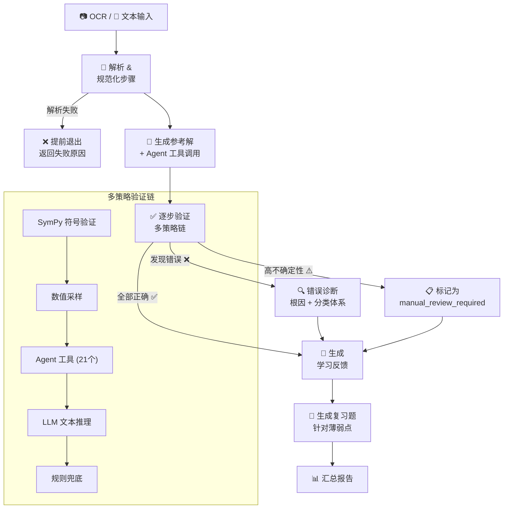

# 🔬 STEM Tutor Agent

> **你的数学解错了。这里是确切位置和原因。**

AI 智能辅导系统，逐步验证学生解题过程，用 SymPy 符号计算精确定位错误根因，并生成靶向练习题 —— 覆盖 8 个理工科学科，提供完整的 Web 界面。

**[English](README.md)** | 中文

[](https://python.org)
[](https://github.com/langchain-ai/langgraph)
[](https://fastapi.tiangolo.com)
[](https://sympy.org)
[](LICENSE)

## 工作流程



## 为什么选择 STEM Tutor Agent？

把你的解答粘贴到 ChatGPT，它会告诉你*"这个不对"*。STEM Tutor Agent 会说：

> **第 3 步存在链式法则误用** —— 你将 $\frac{d}{dx}f(g(x))$ 计算为 $f'(g(x))$ 而非 $f'(g(x)) \cdot g'(x)$。错误代码 `CHAIN_RULE_MISUSE`。

| 通用 LLM 对话 | STEM Tutor Agent |
|---|---|
| "你的答案错了" | 精确定位**具体步骤**并给出错误代码 |
| 无结构化验证 | **多策略链**：SymPy → 数值采样 → Agent 工具 → LLM → 规则兜底 |
| 一次性反馈 | **追问对话**深入讨论任意步骤 |
| 无练习题生成 | 基于薄弱点自动生成**靶向复习题** |
| 仅文本输入 | **OCR + 图片裁剪 + LaTeX 实时预览** |
| 无学习进度追踪 | **学习报告**汇总跨题知识盲区 |

## 核心特性

- 🔢 **多策略验证** — 5 层验证链（SymPy 符号 → 数值采样 → 21 个 Agent 工具 → LLM 推理 → 规则兜底），用数学严谨性验证每一个步骤
- 🎯 **结构化错误诊断** — 4 大类 9 个错误代码（法则应用、代数运算、定理误用、概念混淆），附带证据链和置信度
- 📝 **靶向练习生成** — 基于已识别的薄弱点自动生成 1-3 道复习题，而非随机练习
- 🧪 **8 个理工科学科** — 微积分、线性代数、力学、电磁学、光学、量子力学、相对论、热力学，每个学科有独立 YAML 配置和错误分类体系
- 🖥️ **完整 Web 界面** — FastAPI + 原生 JS SPA，支持 OCR 上传（裁剪 + 拖拽）、KaTeX 预览、SSE 流式输出、追问对话、批量队列、用户账户和管理面板
- ⚡ **预算感知 Agent** — 全局预算池 + 按节点时间配额；3 档深度（`quick` / `standard` / `thorough`），自动降级到轻量策略

## 快速开始

### 环境要求

- Python 3.10+（推荐 3.11）

### 安装 & 运行

```bash
pip install -e .
python -m web.app
```

访问 http://localhost:8000。首次启动自动创建管理员账户：`admin / admin123`。

<details>
<summary>📖 更多运行方式</summary>

**一键公网访问（Windows）**

双击 `start.bat` 启动本地服务器 + Cloudflare Tunnel，自动生成公网 URL（需安装 [cloudflared](https://developers.cloudflare.com/cloudflare-one/connections/connect-networks/downloads/)）。

**命令行**

```bash
# Mock 模式（无需 API Key）
python -m cli.main --input fixtures/sample_case.json --provider mock

# 真实模型 API
python -m cli.main --input fixtures/sample_case.json --provider real --health-check
```

**运行测试**

```bash
pytest -q
```

共 24 个测试文件，使用 `tmp_path` + `monkeypatch` 实现数据库隔离 —— 无需真实 LLM 服务。

</details>

## 架构

### 目录结构

```
stem-tutor-agent/
├── stem_tutor/
│   ├── domain/              # Pydantic 数据模型
│   ├── graph/               # LangGraph 状态定义 & 工作流
│   │   ├── state.py         #   全局状态 TutorGraphState
│   │   ├── workflow.py      #   主图构建 & 执行
│   │   ├── budget.py        #   按节点时间预算管理
│   │   ├── global_budget.py #   跨节点全局预算池
│   │   ├── agent_subgraph.py#   Agent 子图（工具调用）
│   │   ├── strategy.py      #   多策略验证链
│   │   └── observability.py #   Provider 调用追踪 & 不确定性标记
│   ├── nodes/               # 业务节点实现
│   ├── prompts/             # 提示词模板
│   ├── providers/           # LLM Provider 抽象层
│   ├── subjects/            # 学科配置（8 个 YAML）& 自动检测
│   ├── taxonomy/            # 错误分类体系
│   ├── tools/               # Agent 计算工具（21 个工具）
│   ├── evaluation/          # 评测框架
│   ├── settings.py          # 配置加载（环境变量 + key.env）
│   └── sympy_verify.py      # SymPy 符号验证引擎
├── web/
│   ├── app.py               # FastAPI 路由（35+ 端点）
│   ├── database.py          # SQLite CRUD（8 张表）
│   ├── auth.py              # JWT 认证
│   ├── batch_worker.py      # 后台队列 Worker
│   ├── templates/           # HTML 模板
│   └── static/              # CSS / JS（原生 SPA）
├── cli/                     # CLI 入口
├── tests/                   # 24 个测试文件
└── fixtures/                # 测试样本
```

### 核心工作流

8 节点 LangGraph StateGraph，支持条件路由：

| 节点 | 功能 |
|------|------|
| `ocr_preprocess` | 图片 OCR 预处理（可选） |
| `parse_student_solution` | 拆分 & 规范化学生步骤 |
| `generate_reference_solution` | LLM 参考解 + Agent 工具调用 |
| `verify_steps` | 多策略验证（核心节点） |
| `diagnose_error` | 根因诊断 + 分类体系 |
| `generate_feedback` | 面向学生的学习反馈 |
| `generate_review_problems` | 靶向练习题生成 |
| `finalize_report` | 报告汇总 |

<details>
<summary>🔧 Agent 工具链（21 个工具）</summary>

| 模块 | 工具 | 说明 |
|------|------|------|
| **通用** | `execute_python` | 沙箱 Python 子进程执行 |
| **微积分** | `compute_derivative` | 符号微分 |
| | `compute_integral` | 定积分 / 不定积分 |
| | `compute_limit` | 极限计算 |
| | `compute_series` | 泰勒展开 |
| | `solve_equation` | 方程求解 |
| | `solve_ode` | ODE 求解 |
| | `simplify_expression` | 表达式化简 |
| | `compute_pipeline` | 批量多步计算（支持 `$1`, `$2` 引用） |
| **线性代数** | `matrix_multiply` | 矩阵乘法 |
| | `matrix_add` | 矩阵加法 |
| | `matrix_inverse` | 矩阵求逆 |
| | `matrix_determinant` | 行列式 |
| | `matrix_eigenvalues` | 特征值 |
| | `matrix_eigenvectors` | 特征向量 |
| | `matrix_rank` | 矩阵秩 |
| | `matrix_rref` | 最简行阶梯形 |
| | `matrix_transpose` | 转置 |
| | `matrix_trace` | 迹 |
| | `solve_linear_system` | 线性方程组求解 |

</details>

<details>
<summary>🗄️ 数据库 Schema（8 张表）</summary>

| 表 | 说明 |
|----|------|
| `users` | 用户账户（id, username, password_hash, is_admin, created_at） |
| `runs` | 分析运行记录（JSON 数据, 状态, 学科, 题目文本） |
| `chats` | 对话历史（关联 run_id，消息为 JSON 数组） |
| `reports` | 学习报告（JSON 数据, 标题） |
| `user_settings` | 用户偏好设置（JSON） |
| `user_mastery` | 用户掌握度数据（JSON） |
| `batches` | 批量分析批次（状态, settings_json, 计数统计） |
| `batch_items` | 批量条目（题目文本, 学生解答, 状态, run_id） |

</details>

## Web API

### 核心端点

| 方法 | 路径 | 说明 |
|------|------|------|
| `POST` | `/analyze/stream` | SSE 流式分析 |
| `POST` | `/analyze` | 同步分析 |
| `POST` | `/chat/stream` | SSE 流式追问对话 |
| `POST` | `/ocr` | 图片 OCR 识别 |
| `POST` | `/detect-subject` | 自动检测学科 |
| `POST` | `/report/generate` | 生成学习报告 |

<details>
<summary>📋 完整 API 参考（35+ 端点）</summary>

**分析**

| 方法 | 路径 | 说明 |
|------|------|------|
| `POST` | `/analyze` | 同步分析，返回完整结果 |
| `POST` | `/analyze/stream` | SSE 流式分析 |
| `GET` | `/analyze/status/{run_id}` | 查询运行状态 |
| `GET` | `/analyze/result/{run_id}` | 获取运行结果 |
| `POST` | `/analyze/cancel/{run_id}` | 取消运行中的分析 |
| `POST` | `/api/verify-step` | 单步重新验证 |

**追问对话**

| 方法 | 路径 | 说明 |
|------|------|------|
| `POST` | `/chat/stream` | SSE 流式追问对话 |
| `GET` | `/chat/history/{run_id}` | 获取对话历史 |

**学习报告**

| 方法 | 路径 | 说明 |
|------|------|------|
| `POST` | `/report/generate` | 生成学习报告（SSE 流式） |
| `GET` | `/report/data` | 获取报告数据（支持日期筛选） |
| `GET` | `/report/runs` | 列出可用于生成报告的运行记录 |
| `GET` | `/report/list` | 分页列出已生成的报告 |
| `GET` | `/report/{report_id}` | 获取报告详情 |
| `DELETE` | `/report/{report_id}` | 删除报告 |

**运行管理**

| 方法 | 路径 | 说明 |
|------|------|------|
| `GET` | `/history` | 运行历史列表（分页 + 筛选） |
| `GET` | `/stats` | 聚合统计 |
| `DELETE` | `/api/runs` | 批量删除运行记录 |
| `POST` | `/api/runs/cleanup` | 清理 N 天前的运行记录 |

**批量分析队列**

| 方法 | 路径 | 说明 |
|------|------|------|
| `POST` | `/batch/create` | 创建批量分析 |
| `GET` | `/batch/list` | 列出当前用户的批次 |
| `GET` | `/batch/{batch_id}/status` | 查询批次状态 & 进度 |
| `POST` | `/batch/{batch_id}/pause` | 暂停批次 |
| `POST` | `/batch/{batch_id}/resume` | 恢复批次 |
| `POST` | `/batch/{batch_id}/cancel` | 取消批次 |
| `DELETE` | `/batch/{batch_id}` | 删除批次 |

**认证**

| 方法 | 路径 | 说明 |
|------|------|------|
| `POST` | `/api/auth/register` | 注册新用户 |
| `POST` | `/api/auth/login` | 登录获取 JWT Token |
| `GET` | `/api/auth/me` | 获取当前用户信息 |

**用户设置 & 掌握度**

| 方法 | 路径 | 说明 |
|------|------|------|
| `GET` | `/api/user/settings` | 获取用户偏好 |
| `POST` | `/api/user/settings` | 保存用户偏好 |
| `GET` | `/api/user/mastery` | 获取用户掌握度数据 |
| `POST` | `/api/user/mastery` | 更新用户掌握度数据 |

**管理员端点**（需要管理员角色）

| 方法 | 路径 | 说明 |
|------|------|------|
| `GET` | `/api/admin/users` | 列出所有用户 |
| `GET` | `/api/admin/stats` | 系统统计概览 |
| `DELETE` | `/api/admin/users/{user_id}` | 删除用户 |
| `GET` | `/api/admin/users/{user_id}` | 用户信息 + 设置 + 掌握度 |
| `GET` | `/api/admin/users/{user_id}/runs` | 用户运行记录 |
| `GET` | `/api/admin/users/{user_id}/reports` | 用户学习报告 |
| `GET` | `/api/admin/users/{user_id}/chats` | 用户对话记录 |
| `GET` | `/api/admin/users/{user_id}/settings` | 用户设置详情 |
| `GET` | `/api/admin/users/{user_id}/mastery` | 用户掌握度详情 |
| `GET` | `/api/admin/users/{user_id}/run/{run_id}` | 运行详情（含原始输出） |

**流式响应示例**

`/analyze/stream` 返回 Server-Sent Events：

```
data: {"type": "start", "run_id": "...", "message": "分析已开始"}
data: {"type": "node_start", "node": "parse_student_solution", "label": "解析解题步骤"}
data: {"type": "progress", "node": "parse_student_solution", "detail": "已解析 5 个步骤"}
data: {"type": "node_done", "node": "parse_student_solution", "label": "解析解题步骤", "partial": {...}}
...
data: {"type": "result", "data": {...}}
data: {"type": "done", "message": "分析完成"}
```

</details>

## 配置

项目从工作区根目录读取 `key.env`（参考 `key.env.example`），支持环境变量覆盖。

### 基础配置

| 变量 | 说明 | 默认值 |
|------|------|--------|
| `STEM_TUTOR_PROVIDER` | Provider 类型（`mock` / `openai-compatible`） | `mock` |
| `STEM_TUTOR_SUBJECT` | 默认学科 | `calculus` |
| `PARATERA_API_KEY` | LLM API Key | （空） |
| `PARATERA_URL` | LLM API URL | （空） |

<details>
<summary>⚙️ 全部配置项</summary>

### 模型配置

| 变量 | 说明 | 默认值 |
|------|------|--------|
| `STEM_TUTOR_REASONING_MODEL` | 推理模型（参考解生成等） | `qwen/qwen3.6-plus` |
| `STEM_TUTOR_FAST_MODEL` | 快速模型（验证、诊断、反馈等） | `deepseek/deepseek-v3.2` |
| `STEM_TUTOR_OCR_MODEL` | OCR 视觉模型 | `qwen/qwen3.6-plus` |
| `STEM_TUTOR_BASELINE_GLM5_MODEL` | 基线对比模型（GLM5） | `qwen/qwen3-30b-a3b-instruct-2507` |
| `STEM_TUTOR_BASELINE_KIMI_MODEL` | 基线对比模型（Kimi） | `qwen/qwen3-30b-a3b-instruct-2507` |
| `STEM_TUTOR_DETECTION_MODEL` | 学科检测模型 | `qwen/qwen3-30b-a3b-instruct-2507` |
| `STEM_TUTOR_VERIFY_MODEL_GROUP` | 验证使用的模型组 | `fast` |
| `STEM_TUTOR_VERIFY_MODEL` | 覆盖验证模型（空 = 使用模型组） | （空） |

### 功能开关 & 参数

| 变量 | 说明 | 默认值 |
|------|------|--------|
| `STEM_TUTOR_SYMPY_ENABLED` | 启用 SymPy 符号验证 | `true` |
| `STEM_TUTOR_SYMPY_TIMEOUT` | SymPy 计算超时（秒） | `3.0` |
| `STEM_TUTOR_TOOL_CALLING` | 启用 Agent 工具调用 | `false` |
| `STEM_TUTOR_DUAL_MODEL` | 启用双模型 Agent 模式 | `false` |
| `STEM_TUTOR_BUDGET_ENABLED` | 启用全局预算管理 | `false` |
| `STEM_TUTOR_LOAD_LEGACY_TOOLS` | 加载完整工具集 | `false` |
| `STEM_TUTOR_PYTHON_EXECUTABLE` | Python 沙箱解释器路径 | （空） |
| `STEM_TUTOR_PYTHON_TIMEOUT` | Python 沙箱超时（秒） | `10.0` |
| `STEM_TUTOR_TIMEOUT` | 请求超时（秒） | `300` |
| `STEM_TUTOR_MAX_RETRIES` | 最大重试次数 | `1` |
| `STEM_TUTOR_ALLOW_MOCK_FALLBACK` | 允许回退到 Mock | `true` |
| `STEM_TUTOR_DEPTH` | 分析深度（`quick` / `standard` / `thorough`） | `standard` |
| `STEM_TUTOR_SIMPLE_FASTPATH` | 启用简单问题快速路径 | `true` |
| `STEM_TUTOR_DETERMINISTIC_VERIFY` | 启用确定性验证优先 | `true` |
| `STEM_TUTOR_REFERENCE_MAX_TOOL_ROUNDS` | 参考解最大工具调用轮次 | `1` |
| `STEM_TUTOR_AGENT_REQUEST_TIMEOUT` | Agent 请求超时（秒） | `45` |
| `STEM_TUTOR_AGENT_MAX_DURATION` | Agent 最大持续时间（秒） | `90` |
| `STEM_TUTOR_HINT_MAX_CHARS` | 计算提示最大字符数 | `1200` |
| `STEM_TUTOR_INCLUDE_FAILED_HINTS` | 在提示中包含失败的工具结果 | `false` |
| `STEM_TUTOR_TOOL_RESULT_MAX_CHARS` | 工具结果截断字符数 | `200` |
| `STEM_TUTOR_NODE_TIMING` | 启用节点级计时 | `true` |
| `STEM_TUTOR_PARALLEL_REVIEW` | 启用并行复习题生成 | `true` |

</details>

<details>
<summary>📊 数据模型</summary>

| 模型 | 用途 |
|------|------|
| `ProblemInput` | 问题输入（支持文本 / OCR 来源） |
| `SolutionStep` | 学生解题步骤 |
| `VerificationResult` | 步骤验证结果（标签 / 证据 / 置信度 / SymPy 标记） |
| `VerificationLabel` | 验证标签枚举：`correct` / `incorrect_math` / `inconsistent_or_unsupported` / `unclear` |
| `ErrorDiagnosis` | 错误诊断（错误代码 / 类别 / 根因假设 / 证据 / 置信度） |
| `FeedbackReport` | 学习反馈报告 |
| `ReviewProblem` | 复习题 |
| `ReferenceSolutionPayload` | 参考解输出（文本 + 关键断言） |
| `VerificationPayload` | 轻量验证载荷（用于 Agent 子图结构化输出） |
| `DiagnosisPayload` | 轻量诊断载荷 |
| `FeedbackPayload` | 轻量反馈载荷 |
| `ReviewProblemsPayload` | 复习题列表载荷 |

</details>

<details>
<summary>🏷️ 错误分类体系</summary>

内置可扩展错误分类。每个学科可通过 YAML 配置扩展或覆盖：

| 错误代码 | 类别 | 说明 |
|----------|------|------|
| `CHAIN_RULE_MISUSE` | 法则应用错误 | 链式法则误用 |
| `SUBSTITUTION_MAPPING_MISMATCH` | 法则应用错误 | 变量替换不一致 |
| `SIGN_ARITHMETIC_ERROR` | 代数运算错误 | 符号或算术化简错误 |
| `COEFFICIENT_OMISSION` | 代数运算错误 | 遗漏系数或常数因子 |
| `FINAL_CALCULATION_ERROR` | 代数运算错误 | 最终数值计算错误 |
| `DOMAIN_CONDITION_IGNORED` | 定理/条件误用 | 忽略定义域或定理前提条件 |
| `OBJECT_CONFUSION_LIMIT_DERIVATIVE_INTEGRAL` | 概念混淆 | 混淆极限 / 导数 / 积分概念 |
| `UNSUPPORTED_JUMP` | 推理质量问题 | 步骤缺乏充分推理依据 |
| `NOTATION_UNCLEAR` | 推理质量问题 | 符号不清晰或歧义 |

</details>

## 评测

<details>
<summary>📈 评测框架</summary>

### 评测命令

```bash
# 工作流模式评测
python -m cli.evaluate --cases fixtures/eval_cases.json --provider mock --mode workflow_r1

# 保存评测结果
python -m cli.evaluate --cases fixtures/eval_cases.json --provider mock --mode workflow_r1 --output logs/eval/latest.json

# 真实模型评测
python -m cli.evaluate --cases fixtures/eval_cases.json --provider real --mode workflow_r1

# 基线对比（单提示词，无工作流）
python -m cli.evaluate --cases fixtures/eval_cases.json --provider real --mode baseline_glm5
python -m cli.evaluate --cases fixtures/eval_cases.json --provider real --mode baseline_kimi
```

### 评测指标

| 指标 | 说明 |
|------|------|
| `avg_verification_accuracy` | 验证准确率 |
| `avg_diagnosis_hit` | 诊断命中率 |
| `avg_error_step_recall` | 错误步骤召回率 |
| `avg_taxonomy_category_hit` | 分类体系类别命中率 |
| `avg_first_error_hit` | 首个错误命中率 |
| `avg_feedback_proxy` | 反馈质量代理指标 |
| `avg_review_relevance_proxy` | 复习题相关性代理指标 |
| `avg_low_conf_trigger_rate` | 低置信度触发率 |
| `avg_real_provider_failure_rate` | 真实 Provider 失败率 |
| `avg_uncertainty_flags` | 不确定性标记数量 |

</details>

## Provider 架构

```
LLMProvider（抽象基类）
├── MockProvider                — 确定性 Mock 输出，用于调试 & 测试
└── OpenAICompatibleProvider    — OpenAI 兼容 API 调用
```

支持 4 个模型组：`reasoning` / `fast` / `ocr` / `baseline`。每个节点可独立配置使用的模型组。验证节点额外支持 `verify` 模型组覆盖。

## 设计原则

- **显式状态** — LangGraph 维护全局状态；所有中间结果可追踪
- **节点解耦** — 每个节点只做一件事；易于单元测试和替换
- **提示词-逻辑分离** — 提示词在 `prompts/`，业务逻辑在 `nodes/`
- **领域知识分离** — 错误分类在 `taxonomy/`，学科配置在 `subjects/`
- **可替换 Provider** — Provider 接口支持无缝切换 Mock / 真实 LLM
- **结构化输出优先** — 所有节点输出 Pydantic 模型，保证结构稳定
- **预算感知降级** — 全局预算池，自动降级到轻量策略

## Credits

由 [ZelinZhou-THU](https://github.com/ZelinZhou-THU) 构建 — 一个注重可解释性的 AI 辅导课程项目。

基于 [LangGraph](https://github.com/langchain-ai/langgraph)、[SymPy](https://www.sympy.org/)、[FastAPI](https://fastapi.tiangolo.com/) 和 [LangChain](https://github.com/langchain-ai/langchain) 生态构建。

## 备注

- 本项目为课程大作业导向的工程原型
- 注重可解释性和可验证性，优先保证过程可信
- 欢迎贡献 —— 请保持清晰的模块边界
- 首次启动自动创建管理员账户：`admin / admin123`
- 访问 `http://localhost:8000/#admin` 进入管理面板（需管理员登录）

## 免责声明

本系统使用 AI 语言模型生成辅导反馈和练习题。虽然我们采用了符号数学、数值采样、工具计算等多策略验证手段来提高准确性，但 AI 生成的内容仍可能存在错误。用户应独立核实关键信息。作者不对使用本系统产生的任何后果承担责任。

## 许可证

[GNU Affero General Public License v3.0](LICENSE)
